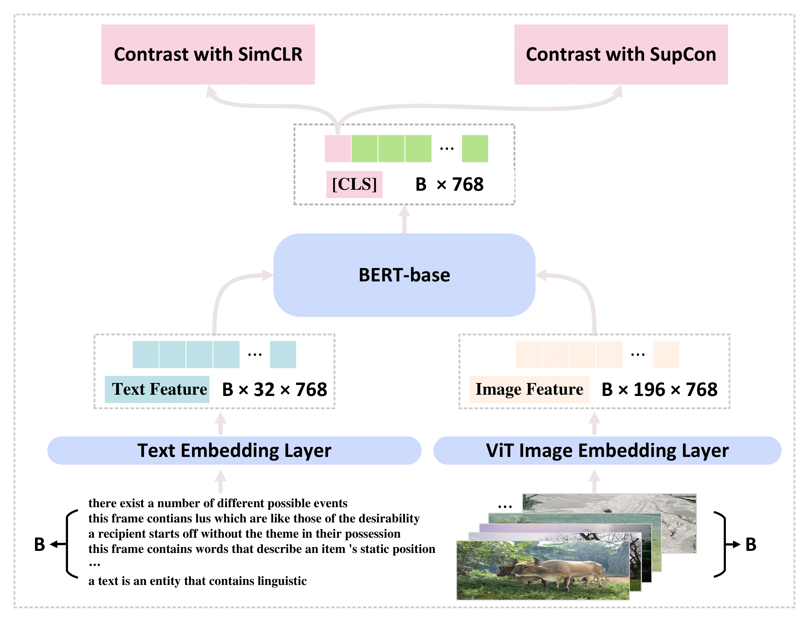

# Non-Linguistic Supervision for Contrastive Learning of Sentence Embeddings

## Overview
This repo covers the implementations of **[VisualCSE](VisualCSE)** and **[AudioCSE](AudioCSE)** in  the following paper: **Non-Linguistic Supervision for Contrastive Learning of Sentence Embeddings** by [Yiren Jian](https://cs.dartmouth.edu/~yirenjian/), [Chongyang Gao](https://gcyzsl.github.io/) and [Soroush Vosoughi](https://www.cs.dartmouth.edu/~soroush/), accepted to NeurIPS 2022.



```bibtex
@inproceedings{jian-etal-2022-non,
  title={Non-Linguistic Supervision for Contrastive Learning of Sentence Embeddings},
  author={Jian, Yiren and Gao, Chongyang and Vosoughi, Soroush"},
  booktitle={Advances in Neural Information Processing Systems},
  year={2022}
}
```

## Acknowlegements
Thanks to [SimCSE](https://github.com/princeton-nlp/SimCSE) for the preliminary implementations.
